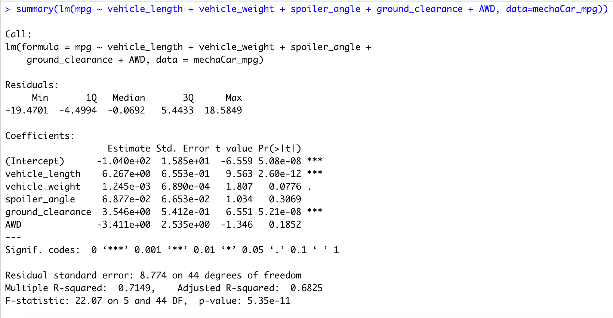

# MechaCar_Statistical_Analysis

## Overview

The project helps a data analyst perform retrospective analysis of historical data, analytical verification and validation of current automotive specifications and study design of future product testing as below:
- Load, clean up, and reshape datasets using tidyverse in R.
- Visualize datasets with basic plots such as line, bar, and scatter plots using ggplot2.
- Generate and interpret more complex plots such as boxplots and heatmaps using ggplot2.
- Plot and identify distribution characteristics of a given dataset.
- Formulate null and alternative hypothesis tests for a given data problem.
- Implement and evaluate simple linear regression and multiple linear regression models for a given dataset.
- Implement and evaluate the one-sample t-Tests, two-sample t-Tests, and analysis of variance (ANOVA) models for a given dataset.
- Implement and evaluate a chi-squared test for a given dataset.
- Perform multiple linear regression analysis to identify which variables in the dataset predict the mpg of MechaCar prototypes.
- Collect summary statistics on the pounds per square inch (PSI) of the suspension coils from the manufacturing lots.
- Run t-tests to determine if the manufacturing lots are statistically different from the mean population.
- Design a statistical study to compare vehicle performance of the MechaCar vehicles against vehicles from other manufacturers. 

## Resources

- R (4.2.2)
- RStudio 

## Linear Regression to Predict MPG

The MechaCar dataset contains 50 prototype MechaCars, which were produced using multiple design specifications to identify ideal vehicle performance.

### Multiple Regression Model

- Multiple regression with R is performed to predict the MPG of MechaCar given certain values of vehicle length, vehicle weight, spoiler angle, drivetrain, and ground clearance.

- With the coefficients generated, the linear model for this scenario can be as below:     
**Y = -0.0104 + 6.267 X1 + 0.0012 X2 + 0.0688 X3 + 3.546 X4 - 3.411 X5 + c**     
where Y = mpg (dependent variable)   
X1 = vehicle length (predictor/independent variable),    
X2 = vehicle weight (predictor/independent variable),    
X3 = spoiler angle (predictor/independent variable),    
X4 = ground clearance (predictor/independent variable),    
X5 = AWD (predictor/independent variable),    
c = random variable representing the error or residuals.   

### Summary of Regression

- From the values of Residuals, it can be observed that the median (=-0.0692) is about centered around zero. This tells that residuals are somewhat symmetrical and that our **model is predicting evenly** at both the high (absolute value: |18.58|) and low (absolute value: |-19.47|) ends of the dataset. This implies a normal distribution. 
- It can be observed that vehicle length and ground clearance have large t-statistic and their corresponding standard errors are small. Larger t-statistic confirms that corresponding coefficient is not zero. 
- The p-values for the coefficients indicate whether these relationships are statistically significant(the confidence that coefficients are not zero). A 95% level of confidence was predetermined, meaning the p-value should be compared to alpha = .05 level of significance to verify if statistically significant. The strongest contributor of non-random variance seems to be the vehicle length with a p-value of 2.60e-12. The other strong contributor of non-random variance is the ground clearance with a p-value of 5.21e-8.
- The coefficient values for each predictor variable are the slope estimates of linear model. It can be observed that **slope estimates are non zero**, though some are close to zero. If we consider the (predictor variable of) vehicle length: Given that other variables are held constant, for a unit increase in vehicle length, mpg increases over 6 times. The negative sign of the coefficient of AWD tells that there is a negative correlation between mpg and AWD.
- In summary, **vehicle length and ground clearance variables represent non-random amounts of variance** as applied to the mpg values. 
- The slope of the linear model is not zero. This can be seen in coefficients that contain significant non-zero values (vehicle length, ground clearance, and AWD), and the p-values are less than the significance level of p=0.05.
- Since R-squared gives the percentage of variance, it can be interpreted that **71.49% of variation in mpg is explained by all the 5 predictors combined**. This is a high percentage of predictability and concludes that roughly 29% of variance in mpg is unexplained.

## Summary Statistics on Suspension Coils

In the Suspension_Coil dataset, the weight capacities of multiple suspension coils were tested to determine if the manufacturing process is consistent across production lots.

### PSI Summary across all Manufacturing Lots
- Below is the PSI summary statistics of all of the manufacturing lots. The mean of all the mots combined is 1498.78, this is close to the median (1500).

### PSI Summary for each Manufacturing Lot
- The PSI summary statistics per lot are shown below. The mean of all lots combined is similar when compared to the mean of each individual lot.

- Lot 3 shows significant deviation of psi values from standard compared to Lot 1 and Lot 2. That means that Lot 3 has more data spread out from its mean as confirmed by its large variance value.

The design specifications for the MechaCar suspension coils dictate that the variance of the suspension coils must not exceed 100 PSI. 
The variance for the total manufacturing lot is 62 < 100, which is within the expected design specifications of staying under 100 PSI, but we can see that there are clearly big problems in Lot 3 with a variance of 170 PSI. Lot 3 does not meet the maximum variance requirement while Lot 1 and Lot 2 comply.

## T-Tests on Suspension Coils

### T-test for all lots

### T-test for Lot 1

### T-test for Lot 2

### T-test for Lot 3

summarize your interpretation and findings for the t-test results. Include screenshots of the t-test to support your summary.

## Study Design: MechaCar vs Competition

short description of a statistical study that can quantify how the MechaCar performs against the competition. In your study design, think critically about what metrics would be of interest to a consumer: for a few examples, cost, city or highway fuel efficiency, horse power, maintenance cost, or safety rating.

In your description, address the following questions:
What metric or metrics are you going to test?
What is the null hypothesis or alternative hypothesis?
What statistical test would you use to test the hypothesis? And why?
What data is needed to run the statistical test?
